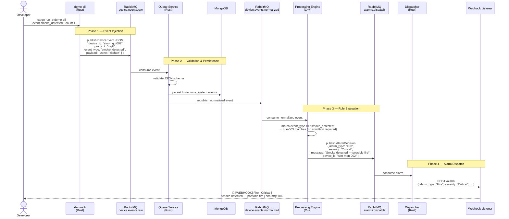
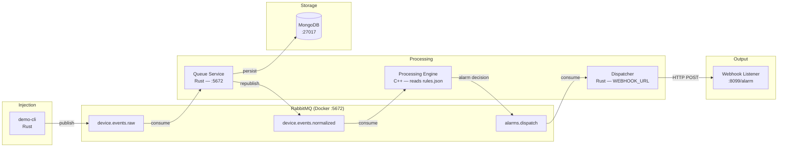

# End-to-End Event Flow

This diagram traces a `smoke_detected` event from injection through alarm delivery. The same path applies to all event types — only the rule matched and alarm output differ.



## Rule Reference

The processing engine evaluates events against 5 rules loaded from `cpp/processing/config/rules.json`:

| Rule | Event Type | Condition | Alarm Type | Severity |
|------|-----------|-----------|-----------|----------|
| rule-001 | `motion_detected` | `zone == "front-door"` | Motion | High |
| rule-002 | `motion_detected` | `zone == "back-yard"` | Motion | Medium |
| rule-003 | `smoke_detected` | _(any)_ | Fire | Critical |
| rule-004 | `door_opened` | _(any)_ | Intrusion | High |
| rule-005 | `flood_detected` | _(any)_ | Flood | High |

`temperature_reading` has no matching rule — events flow through the pipeline and are persisted but produce no alarm.

## Service Connection Map



## Demo Commands

```bash
# Start the pipeline
make services

# Terminal 2: receive alarm notifications
make webhook-listener

# Inject events (from project root)
cargo run --manifest-path rust/Cargo.toml -p demo-cli -- --event smoke_detected --count 1
cargo run --manifest-path rust/Cargo.toml -p demo-cli -- --event flood_detected --count 1
cargo run --manifest-path rust/Cargo.toml -p demo-cli -- --event motion_detected --count 1
cargo run --manifest-path rust/Cargo.toml -p demo-cli -- --event door_opened --count 1
cargo run --manifest-path rust/Cargo.toml -p demo-cli -- --event temperature_reading --count 1  # no alarm

# Stop everything
make stop
```
