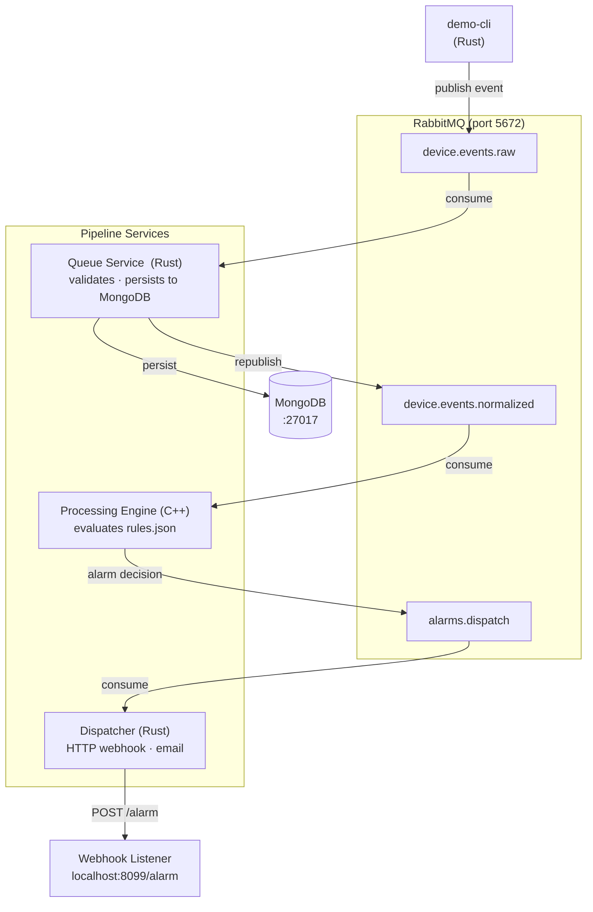
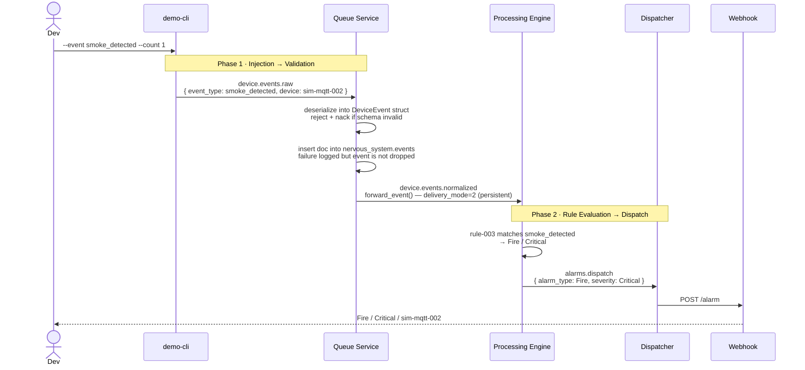

# End-to-End Event Flow

## System Architecture



---

## Phase-by-Phase: smoke_detected



**Queue service — persist & republish** (`rust/queue/src/main.rs`):

```rust
// persist to MongoDB — failure is logged but does not drop the event
if let Err(e) = events_col.insert_one(doc).await {
    warn!("MongoDB insert failed (event not dropped): {}", e);
}

forward_event(&publish_channel, &event).await?;
delivery.ack(BasicAckOptions::default()).await?;

// ---

// forward_event: republish the same DeviceEvent to device.events.normalized
// delivery_mode=2 marks the message as persistent on the broker
async fn forward_event(channel: &lapin::Channel, event: &DeviceEvent) -> Result<()> {
    let payload = serde_json::to_vec(event)?;
    channel
        .basic_publish("", OUTBOUND_QUEUE, BasicPublishOptions::default(),
            &payload, lapin::BasicProperties::default().with_delivery_mode(2))
        .await??;
    Ok(())
}
```

The event is acknowledged only after both the MongoDB write and the republish succeed. If either fails, the broker redelivers the message.

---

## Rule Reference

| Rule | Trigger Event | Condition | Alarm | Severity |
|------|--------------|-----------|-------|----------|
| rule-001 | `motion_detected` | zone = front-door | Motion | High |
| rule-002 | `motion_detected` | zone = back-yard | Motion | Medium |
| rule-003 | `smoke_detected` | _(any)_ | Fire | Critical |
| rule-004 | `door_opened` | _(any)_ | Intrusion | High |
| rule-005 | `flood_detected` | _(any)_ | Flood | High |

`temperature_reading` — no rule match, no alarm.

---

## Demo Commands

```bash
make services        # start the pipeline
make webhook-listener  # terminal 2

# inject events (from project root)
cargo run --manifest-path rust/Cargo.toml -p demo-cli -- --event smoke_detected --count 1
cargo run --manifest-path rust/Cargo.toml -p demo-cli -- --event flood_detected --count 1
cargo run --manifest-path rust/Cargo.toml -p demo-cli -- --event motion_detected --count 1
cargo run --manifest-path rust/Cargo.toml -p demo-cli -- --event door_opened --count 1
cargo run --manifest-path rust/Cargo.toml -p demo-cli -- --event temperature_reading --count 1

make stop            # shut everything down
```
