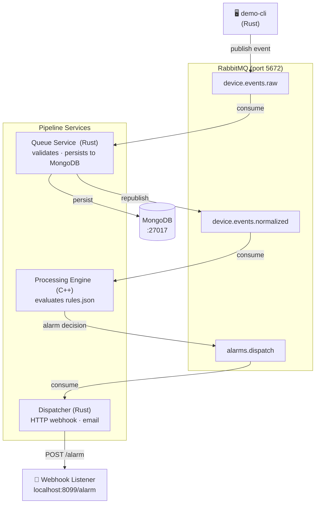
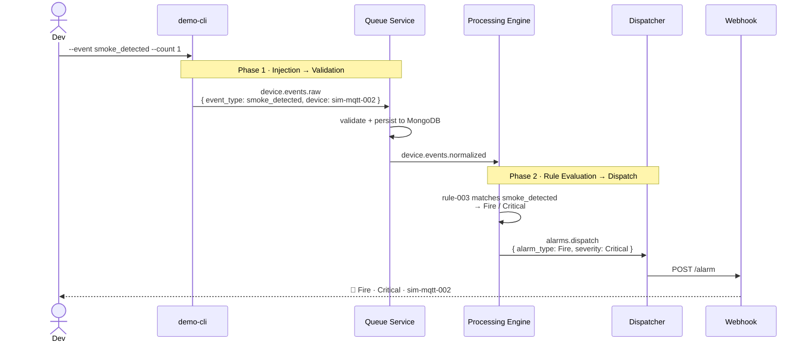

# End-to-End Event Flow

## System Architecture



---

## Phase-by-Phase: smoke_detected



---

## Rule Reference

| Rule | Trigger Event | Condition | Alarm | Severity |
|------|--------------|-----------|-------|----------|
| rule-001 | `motion_detected` | zone = front-door | Motion | High |
| rule-002 | `motion_detected` | zone = back-yard | Motion | Medium |
| rule-003 | `smoke_detected` | _(any)_ | Fire | Critical |
| rule-004 | `door_opened` | _(any)_ | Intrusion | High |
| rule-005 | `flood_detected` | _(any)_ | Flood | High |

`temperature_reading` — no rule match, no alarm.

---

## Demo Commands

```bash
make services        # start the pipeline
make webhook-listener  # terminal 2

# inject events (from project root)
cargo run --manifest-path rust/Cargo.toml -p demo-cli -- --event smoke_detected --count 1
cargo run --manifest-path rust/Cargo.toml -p demo-cli -- --event flood_detected --count 1
cargo run --manifest-path rust/Cargo.toml -p demo-cli -- --event motion_detected --count 1
cargo run --manifest-path rust/Cargo.toml -p demo-cli -- --event door_opened --count 1
cargo run --manifest-path rust/Cargo.toml -p demo-cli -- --event temperature_reading --count 1

make stop            # shut everything down
```
